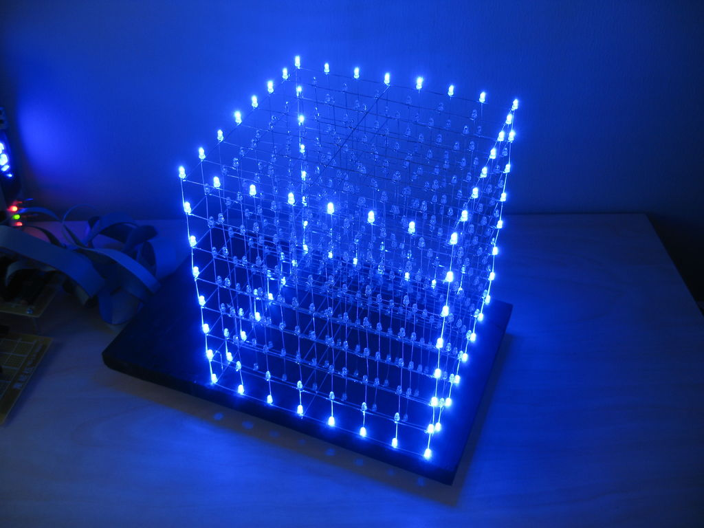
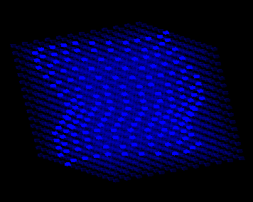
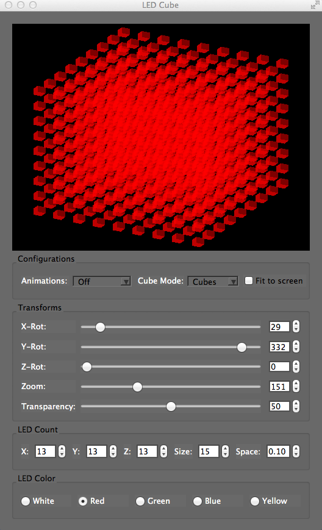
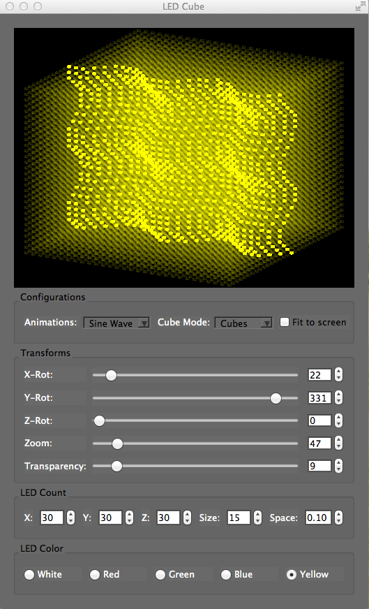

# LED-Cube
A 3D LED cube simulator that can create and simulate cool visual effects, and display 3D objects like human face, and sine wave function.

### Technologies
  C++
  
  OpenGL
  
  QT Creator

### Overview
Our project was to simulate one big cube made of several tiny cubes (voxels) that can be turned on and off to create light effects and animation. Each voxel work as a small led cube that can draw 3D images on the big cube if many voxels are manipulated simultaneously. Images below compare an acutal 'LED Cube' that displays a cube, and our simulator that displays a sine function.

An actual 'LED Cube' displays a cube inside it.

Our 'LED Cube Simulator' displays a sine function.

We achieved the simulation and manipulation of 3D image by adding several control options such as rotation in xyz dimension, zooming, transparency, spacing between each voxels, size of each voxel, different colors, ... , you get the picture. You can see how our software looks like in the images below.

LED Cube Simulator dispalys a big cube made up of several tiny voxels.

LED Cube Simulator displays a sine-function wave animation.

### Credits
[Tenzin Chhosphel](https://www.linkedin.com/in/tenzin15), Lukas Rascius, Parm Sahadeo, Ni Yao.

